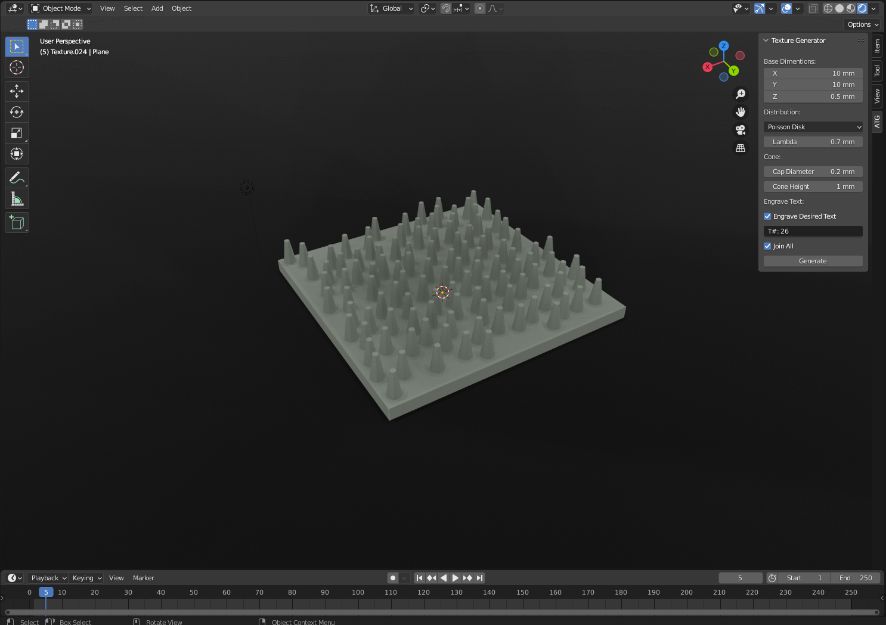
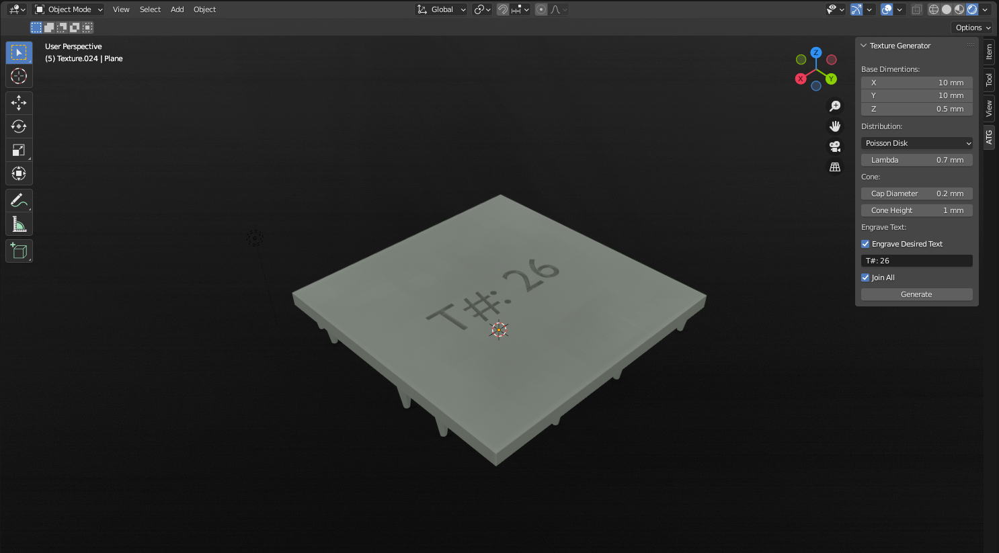

# Blender Artificial Texture Generator Add-on

A Blender plugin to create artificial textures with different roughness by 
distributing cones on a cube base and changing following parameters:

  - Distribution
  - Cone shape
  - Cone diameter
  
  

## Requirements
Blender 3.0, you can download it [here](https://www.blender.org/).  
Install `Requirements.txt` python modules through terminal.

## Features

 - You can define base dimensions via changing **_x, y, z_**  in the panel.
 - In this version you have the option to choose following **_distributions_** from the panel:
   - Poisson Disk
   - Random
   - Anisotropic
   - Custom Distribution
   
   _*Note: if you want to use a custom distribution you should give the generator function in `panel.py` your own point argument which is a list of tuples._
   
 - Set the **_cap diameter_** and **_cap height_**.
 - If you mark  **_engrave desired text_**, you can engrave your own custom text on bottom-center of the model. Default value is `False` and it engraves the distribution parameters automatically.
 - **_Join all_** connects all the components of the model together and returns a solid model as output. 
 

